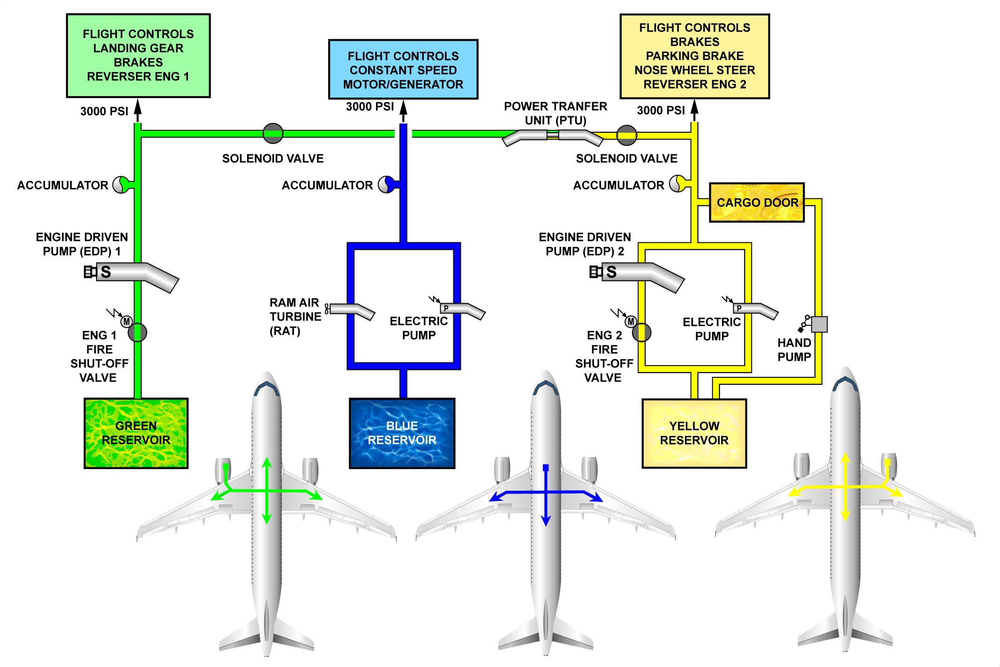

# 00、概述

液压系统共有独立的三套，从左往右依次称为绿系统、蓝系统、黄系统。

液压系统正常供压为 3000 psi（206 bar）。

液压主要供给：

- 飞行操纵面控制
- 起落架收放
- 货舱门开关
- 机轮刹车
- 发动机反推开关

[气源系统](/ATA36/)会给液压油的油箱提供 50 psi（3.5 bar）的压力，以保证在任何情况下液压油泵都能顺利的增压供油（防止气塞）。

绿黄系统的液压油增压主要靠左右发动机驱动泵来完成（EDP），但是黄系统有一个额外的电动泵和一个手摇泵来增压。

蓝系统主要由电动泵来增压（蓝黄系统的电动泵可以互换），应急情况下可以通过 RAT 来增压。

在维护时，三个系统也可以在机下的液压勤务面板上进行地面增压。

