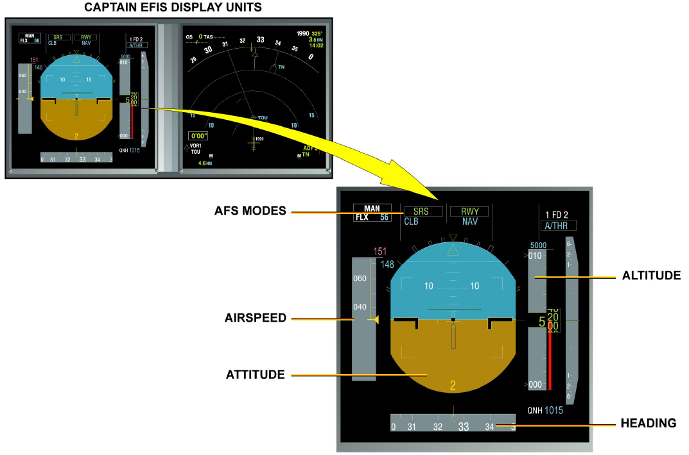
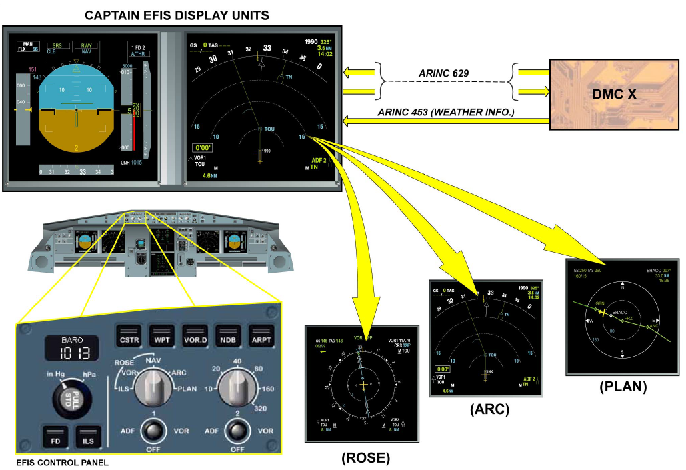
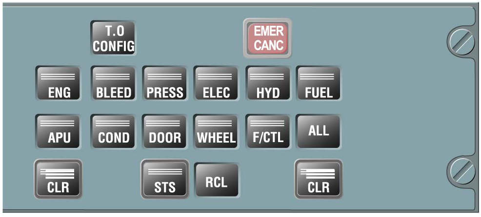

# EIS

EIS（电子仪表系统）主要有两大部分：

- EFIS（电子飞行仪表系统）
- ECAM（电子中央飞机监控系统）

## EFIS

EFIS 由两大部分组成：

- 四个主要的显示组件（DU）：
  - 左右PFD
  - 左右ND
- 三个显示管理计算机（DMC）

> 正常情况下，左座和右座的PFD都是显示在外侧，ND都是显示在内侧，同一座的PFD和ND是可以互换位置显示的，但是像把左座的PFD显示到右座这样的操作是不能的，这是因为：
>
> - 机长侧的 PFD/ND 显示由DMC-1负责
> - 副驾侧的 PFD/ND 显示由DMC-2负责
> - DMC-3 作为另外两部DMC的热备，在故障时人工切换到 DMC-3，其实也算不上真正的热备（A330是自动切换的，是真的热备）

### PFD

PFD（主飞行显示），顾名思义，用来显示用于飞机控制的飞行信息：

- 飞机姿态
- 飞行高度
- 空速
- 航向
- 自动飞行的模式

### ND

ND（导航显示），顾名思义，用来显示导航相关的信息

在 EFIS 控制面板上，可以人工选择 ND 的显示模式：

- 罗盘模式（ROSE）：
  - ILS（仪表着陆）
  - VOR（甚高频全向信标）
  - NAV（全罗盘航图）
- ARC（扩展航图）
- PLAN（飞行计划）

当然，气象雷达的信息也在 ND 上显示

## ECAM

ECAM 有两个主要的显示组件：

- 上 ECAM：EWD
- 下 ECAM：SD

ECAM还有一个控制面板，称为 ECP

### EWD

EWD 是上ECAM显示，在屏幕上它右分三个区域显示不同的信息：

- 上半部分的信息是一直显示的，因为非常重要：
  - 发动机的主要参数
  - 襟翼/缝翼的位置指示
  - 机载燃油量
- 左Memo区（左下部分）：
  - 故障信息及需要执行的操作
  - 警告信息
  - 备忘信息
- 右Memo区（右下部分）：
  - 与左Memo区差不多

有时Memo区会显示一些符号：

- 一个向下的箭头符号，这是因为左Memo区的信息太多，显示不下了，提醒我们下面还有信息
- STS符号，提醒我们查看SD上的STS页面
- ADV符号，提醒我们监控SD上的系统页面，有飞行参数发生漂移（有发生故障的趋势）

### SD

SD 是下ECAM显示，主要显示部分系统（11个）的主要状态信息：

- 发动机（次要参数）
- 引气
- 压力
- 电源
- 液压
- 燃油
- APU
- 空调
- 门（包括氧气）
- 轮子
- 飞控

这11个页面既可以在ECP面板上人工选择出现，也可以某些情况下自动出现

除了这11个系统页面外，SD还能显示另一个页面：**巡航页面**，巡航页面是在飞机进入巡航阶段后自动显示的，它不能通过操作ECP调出来，但是也可以在地面人工选择出现：执行灯光测试