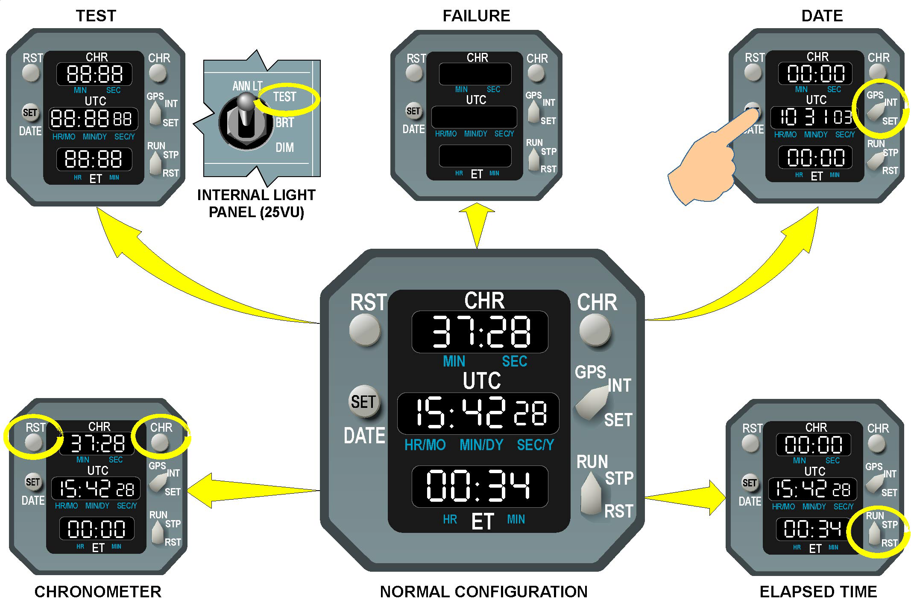
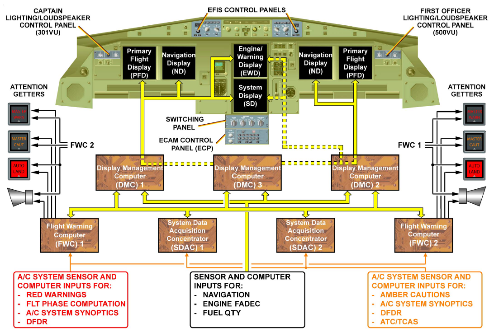

# Other

## CFDS

CFDS（中央故障显示系统）有一部计算机 CFDIU（中央故障显示接口组件），它将所有的飞机故障信息和一些其他信息集中存储起来，MCDU 是CFDS与人交互的唯一接口，通过它可以查看很多故障信息，也能通过它使用打印机将这些信息打印出来，还能通过执行系统测试（BITE）

## 时钟

时钟位于EWD的右侧，飞机上几乎各个系统的时间都是由时钟提供，当时钟失去主供电以后，虽然不能显示，但它的时间功能仍然通过电瓶供电在内存中运行，而其他功能失效

## 最后

> 关于仪表指示系统部分差不多都介绍了一下，还剩一些相关的计算机没有介绍：
> - DMC
> - FWC
> - SDAC

> 更多详细的介绍请参阅[中级篇]()和[高级篇]()