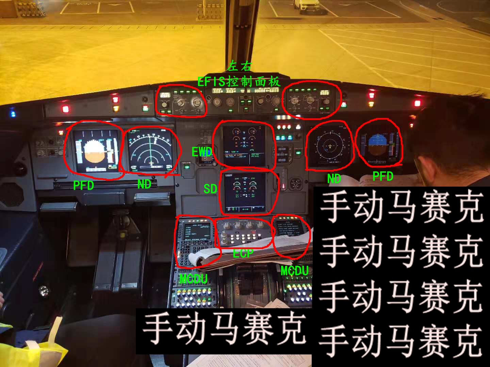

# 概述

这一章分为两大部分：

- 仪表指示部分（EIS）
- 记录系统部分

仪表指示部分又分为四大部分：

- **仪表**
- **CFDS**(中央故障显示系统)
- **EFIS**(电子飞行仪表系统)
- **ECAM**(中央电子飞机监控)

其中：EFIS + ECAM = EIS(电子仪表系统)

相关的仪表部件：

- 在遮光板的左右两侧**各有1块**[EFIS控制面板]()
- 在主仪表板的左右两侧**各有2块**屏幕：主飞行显示（[PFD]()）和导航显示（[ND]()）
- 在主仪表板的中间上下**共有2块**屏幕：上ECAM（[EWD]()，发动机和警告显示）和下ECAM（[SD]()，系统显示）
- 在中央操作台的左右两侧**各有1块**屏幕：左右[MCDU]()的屏幕
- 两个MCDU中间夹着的是[ECP]()（ECAM控制面板）

