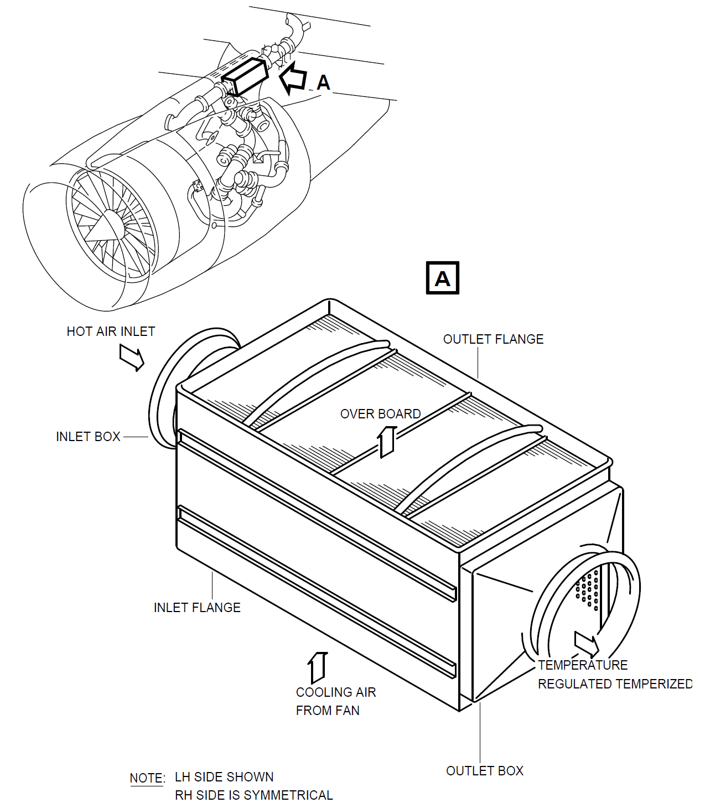

# 二、发动机引气（CFM56）

在飞行中，发动机引气是空气系统的主要气源。

发动机的引气是从发动机的高压压气机的第5级(中压级)或第9级(高压级)引出。

在三大气源中，只有发动机的引气可以在一定程度上调节压力和调节温度。

当发动机在低功率（低转速）情况下，即慢车状态时，由于这时中压级压力不足，就从高压级引气，当发动机功率上来以后，中压级有了足够的压力，为了减少发动机的能量损失，这时会切换到中压级引气。

正常情况下，中压级和高压级不能同时引气。

引气从发动机引出来后，经过压力调节活门调节压力，再继续经过超压活门，再经过预冷器调温，然后输出到分配管道，通过分配管道输送到各个用户。

## 1、高压级引气--HPV

在高压压气机的第9级处，装有一个活门，这个活门叫做高压引气活门(**`HPV`**)，高压级的引气便是通过这个活门引出，进入其下游的管道。（确切的说应该叫做HPV组件，它既有活门本身，也包含相关的控制、传感、测试部件）。

HPV是一个气动工作的蝶形活门，正常情况下，由弹簧保持在关闭位，当第9级的压力达到8psi时，压力大于弹簧的力，HPV便可以打开。

HPV打开得越多，其下游管道的静压也就越大，因此HPV将其下游管道的空气静压限制在了36psi左右(工程误差±3psi)，

## 2、中压级引气--IPCV

在高压压气机的第5级处，装有一个单向的活门，叫做中压引气活门(**`IPV`**或**`IPCV`**)，中压级的引气通过这个活门引出。

单向的活门可以防止在高压级引气时，由于相对于中压级的正压差，气流倒灌回中压级。

IPCV只有简单的开关功能，没有压力调节或压力限制的作用。

## 3、压力调节--PRV

空气从HPV或IPCV引出后，会继续流向下游经过一个活门，叫引气压力调节器活门(**`PRV`**)，顾名思义，PRV的主要作用就是调节它的下游的空气压力。

与HPV类似，PRV也是一个蝶形活门，正常情况下由弹簧保持在关闭位，能使得它打开的最小上游压力也是8psi。

PRV气动调节其下游压力在44psi左右(工程误差±3psi)。

## 4、超压防护--OPV

引气经过PRV后，继续流向下游，经过超压防护活门(**`OPV`**)。

OPV也是蝶形活门，并且是完全气动工作的，正常情况下由弹簧保持在打开位。

OPV的作用是防止引气管道超压，在超压时，及时关闭以切断引气。

::: warning 注意
对于不同件号的OPV，其工作压力是不一样的，**请以AMM中的值为准**，例如：

- P/N: 6740B05xxxx，上游压力升到`(81, 85)`psi时活门开始关闭，`＞85`psi时，完全关闭，降到`＜50`psi时，才能重新打开
- P/N: 6740E01xxxx，上游压力升到`(81, 85)`psi时活门开始关闭，`＞85`psi时，完全关闭，降到`(20, 57.2)`psi时，才能重新打开
- P/N: 6740F01xxxx，上游压力升到`(81, 85)`psi时活门开始关闭，`＞85`psi时，完全关闭，降到`(29, 56)`psi时，才能重新打开
- P/N: 6740B03xxxx，上游压力升到`(79.78, 85.57)`psi时活门开始关闭，达到`(84.13, 89.92)`psi时，完全关闭，降到`＝34.95`psi时，才能重新打开
- P/N: 6740B01xxxx，上游压力升到`＝55`psi时开始关闭，直到完全关闭，降到`=34.95`psi时，才能重新打开
:::

## 5、温度调节--FAV与预冷器

由于从发动机引出的空气是被压缩过的高压空气，因此其温度会升高，在进入引气分配管道前，需要提前冷却一下。

引气通过OPV后，会流入`预冷器`。预冷器是一个气冷式的热交换器。如下图所示：

预冷器中的热空气来自发动机引气（内涵道），而冷空气则来自于发动机的风扇（外涵道）。

风扇空气是自然吸气，温度较低，因此只需将一部分风扇空气引出，通过预冷器与发动机的高温引气进行热交换，便可以将高温引气降温。

风扇空气的引出需要经过一个活门，这个活门叫做风扇空气活门（`FAV`）。

FAV是一个蝶形活门，正常情况下由弹簧保持在关闭位。能使其打开的最小上游压力为8psi。如下图所示：

通过调节FAV的开度，便可以调节发动引气的温度在200℃左右（误差±15℃）。

经过预冷器调温后，发动机的引气便进入分配管道。