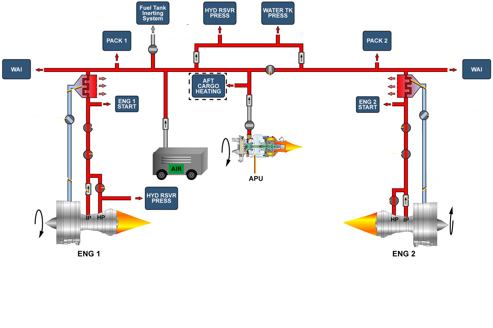

# 四、引气的分配

从上图可以看到引气主要分配：

- 左发的引气从HPV出来以后，有一部分直接给液压储压器增压
- 双发、APU和高压地面气源的引气进入分配总管以后，由总管分配给各个用户

分配总管上有一个活门：`交输引气活门`。

以交输活门为界，引气系统从逻辑上分为了左右两个部分：

- 左侧：左发、高压地面气源、APU
- 右侧：右发

当交输引气活门关闭时，引气系统的左右两个部分被隔离，各自向本侧的用户供气。

当交输引气活门打开时，引气系统的左右两个部分连通，若某一侧的供气故障，便可以使用另一侧的供气。