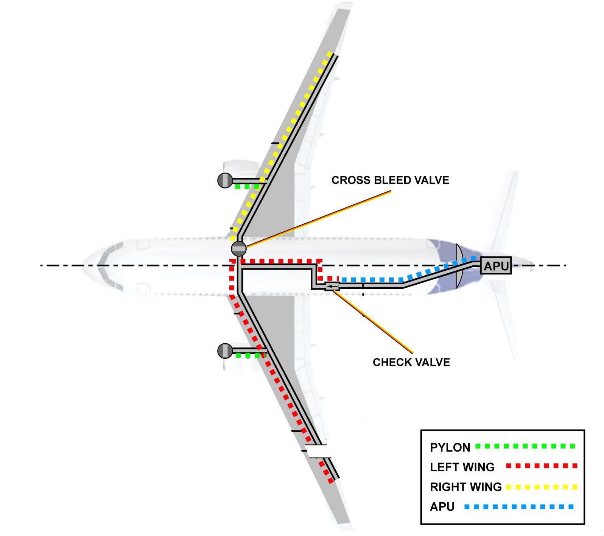

# 五、环境保护（渗漏探测）

环境防护系统分三大块：

- 大翼前缘防护
- 发动机吊架防护
- 发动机短舱防护

环境防护系统将这些区域的气压限制在一定的范围内，如果引气管道或大翼防冰管路着火，又或者出现严重的渗漏，防护系统可以防止这些区域的机身结构受到损伤。

为了探测高温空气的渗漏，许多热敏传感元件串联成环路，沿着各个管道安装，一旦出现引气渗漏，热敏传感元件便可以及时探测到。

## 1、热敏传感元件

目前，现代飞机广泛采用共晶盐热敏传感器作为引气系统的渗漏探测元件，A320锁采用的热敏传感元件的结构示意图如下；

它的中心是一根镍导线，镍导线由一层多孔氧化铝陶瓷绝缘层包裹，在绝缘层外，又套了一层因康镍合金外壳（镍基合金），在镍基合金壳、陶瓷绝缘层和镍导线的空隙之间填充低熔点的共晶盐，然后将镍基合金壳的两端密封，便组成了一个共晶盐热敏传感元件。（多空氧化铝陶瓷的作用就是用来浸共晶盐，作为芯层）

### A、优点和缺点

共晶盐热敏传感器的优点：

- 探测范围大
- 连接线缆少
- 重量轻
- 可靠性高
- 反应迅速

共晶盐热敏传感器的缺点：

- 无法准确定位渗漏点

### B、工作原理

盐是指一类金属离子或铵根离子与酸根离子或非金属离子结合成的化合物。

随着温度的降低，盐溶液的溶液逐渐减少，冰晶颗粒逐渐增多，最后，在降到其共晶点温度时，盐溶液全部变成了固态的水合盐，即共晶盐状态。

在盐溶液中，由于含有大量可以自由移动的离子，因此盐溶液具有导电性，可作为电解质，而随着温度下降，向共晶盐状态变化的过程中，冰晶增多，自由离子减少，因此，其阻抗逐渐增大。当达到共晶盐状态时，带电离子立即停止移动，阻抗突然增大，此时的温度即为盐溶液的共晶温度（共晶点）。

反过来，在共晶盐晶体升温的过程中，其阻抗突然变小时的温度，即为共晶盐的共熔温度（共熔点）。

而一般盐的共晶点和共熔点为同一值，共晶点或共熔点即为共晶盐热敏传感器的阻抗突变的临界点。

共晶态下的盐具有较强的绝缘性，但是温度一旦超过它的共晶温度，其导电性急剧上升，变为低阻抗。

飞机便是利用这个特性来探测引气渗漏的：

其镍基合金外壳接地，中心的镍导线与控制系统相连，当环境温度超过阈值时，芯层的阻抗突然下降，于是中心的镍导线便与镍基合金外壳接通，控制系统收到超温信号。

当温度降到阈值以下时，传感器又会回到原状态。

## 2、三大环路

由共晶盐热敏传感元件串联成的渗漏探测环路主要分为三大类共5个：

- 左、右大翼探测环路
- 左、右发动机吊架探测环路
- APU探测环路

5个环路之间是独立工作的，某个环路故障不影响其他环路工作。

其中大翼环路是双环路设计，其余为单环路设计。

### A、左右吊架环路

吊架环路沿着吊架安装。

### B、APU环路

以APU引气的单向活门为界，沿后部机身段管路的环路为APU环路，中部机身段的环路属于左大翼环路。

### C、左大翼环路（双环路设计）

以分配总管上的交输引气活门为界，向左延伸到左大翼防冰管路，向后延伸到APU引气单向活门段的环路为左大翼环路。

### D、右大翼环路（双环路设计）

交输引气活门右侧的管路段为右大翼环路。

## 3、探测逻辑

左、右大翼环路、APU环路的温度阈值为124±7℃。

吊架环路的温度阈值为204±12℃。

一旦出现渗漏，周围空气的温度很快就会超过阈值，这时计算机便会收到引气渗漏的信号，从而产生警告。

特别对于两个大翼环路来说，由于它们是双环路设计，即分A、B环路，只有在它们的A、B环路都探测到渗漏时（AND逻辑），计算机才认为该大翼环路有渗漏。