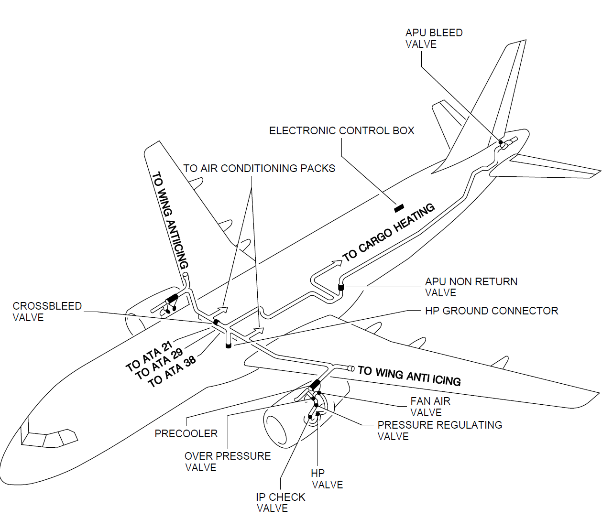

# 一、概述

## 1、作用

空气系统用于向用户们提供合适**温度**、合适**压力**的空气，因为这些用户们需要空气来完成它们的功能。

## 2、用户

- [大翼防冰]()（ATA-30）
- [发动机短舱防冰]()（ATA-30）
- [空调]()（ATA-21）
- [发动机启动]()（ATA-80）
- [液压油箱增压]()（ATA-29）
- [水箱增压]()（ATA-38）

## 3、气源

空气系统主要有三大空气来源：

- [APU引气]()（ATA-49）
- [发动机引气]()（ATA-75）
- 地面高压气源