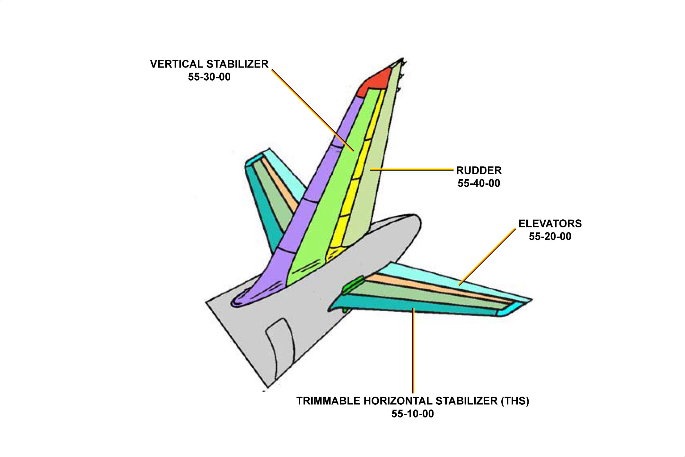

# 00、概述

安定面位于飞机的尾部，主要包括四大部分：

- 垂直安定面
- 方向舵
- THS（可配平的水平安定面）
- 左右升降舵

安定面大部分采用的是复合材料，其主要结构用的是 [CFRP](https://baike.baidu.com/item/CFRP/10532956?fr=aladdin)，其他部件也有用 [GFRP](https://baike.baidu.com/item/GFRP) 的

垂直部分用来保证飞机在水平方向上的稳定性（垂直安定面）和控制飞机的偏航（方向舵）

水平部分用来保证飞机在垂直方向上的稳定性（水平安定面）和控制飞机的俯仰（升降舵、THS）

有**三个独立的**[**液压系统**](/ATA29/)来控制作动方向舵和升降舵，从而来调整飞机的姿态，当然也可以来配平水平安定面和方向舵。

