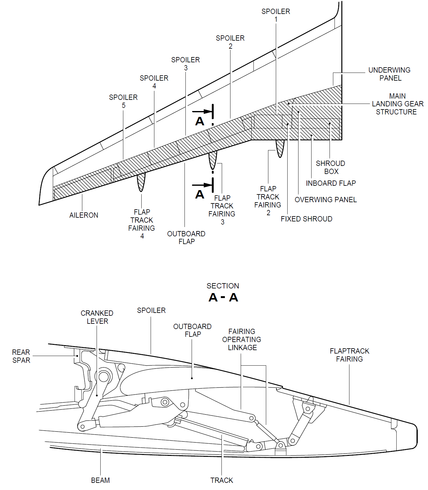
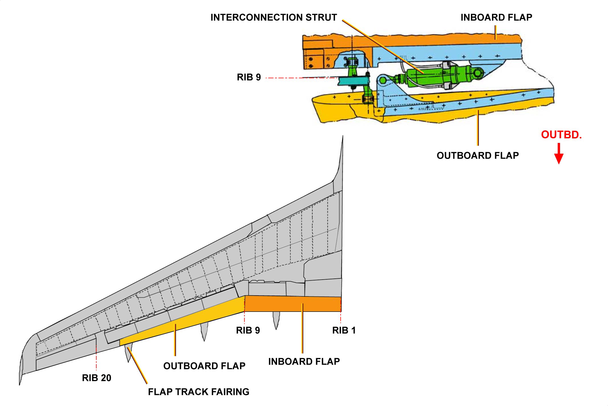
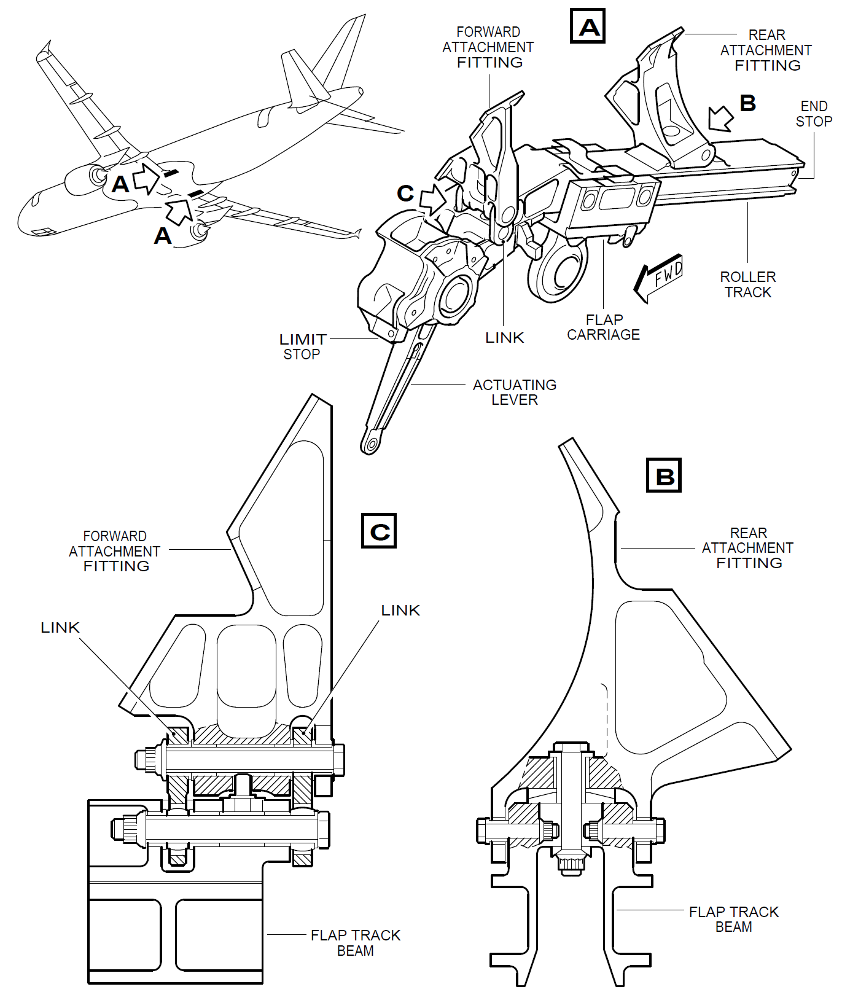
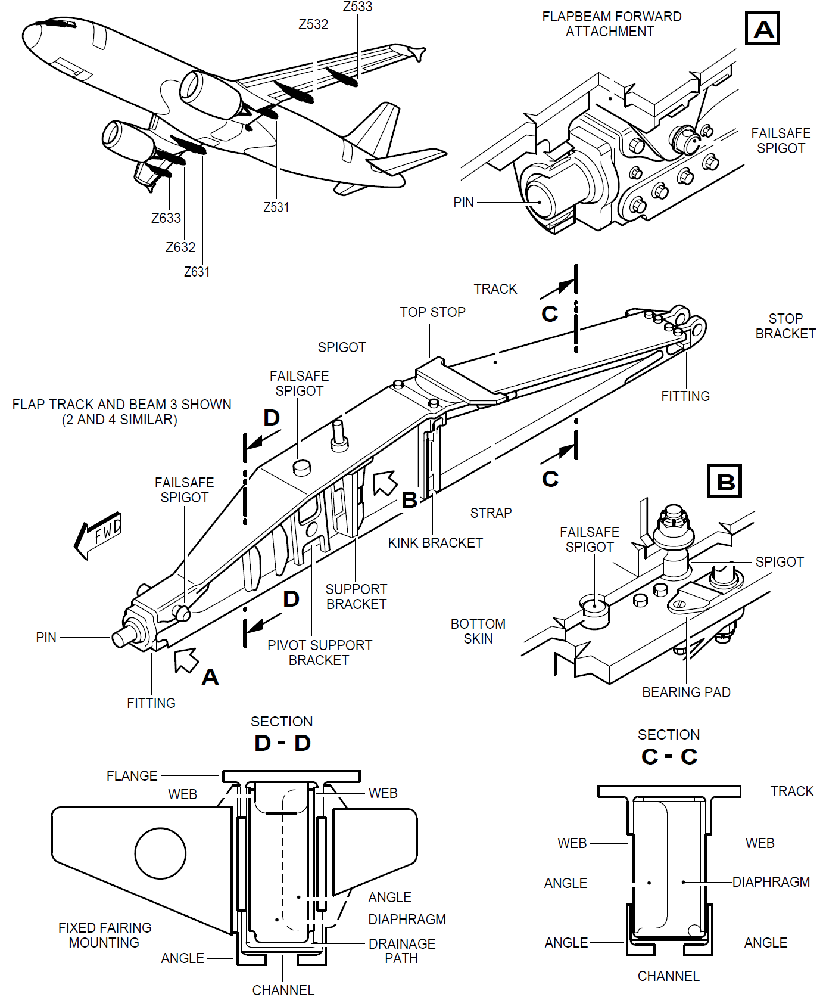

# 50、大翼后缘

大翼的后部分有很多操纵面：

- 襟翼
- 扰流板
- 副翼

这些操纵面都通过[液压系统](/ATA29/)来控制的



## 襟翼

左右大翼各有内外两个襟翼，每个襟翼又有两个滑轨。

襟翼与缝翼一样，也是主要的增升装置，襟翼一般都是与缝翼配合使用。



滑轨的顺序与缝翼一样，从内往外依次为1号、2号、3号、4号滑轨及他们的整流罩

```md
1号滑轨比较隐蔽：
```



```md
2、3、4号滑轨：
```
